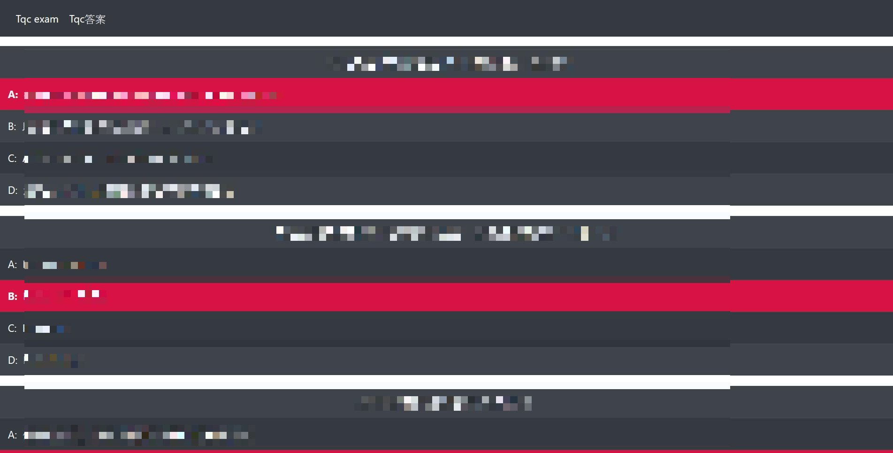
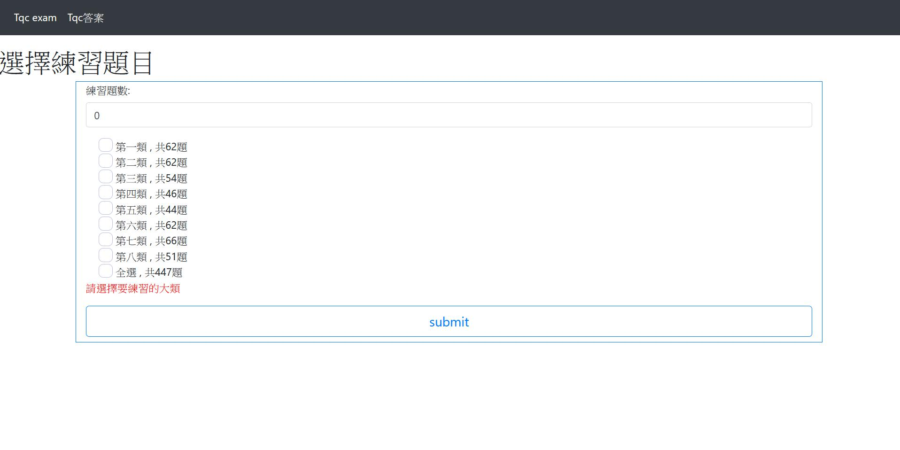
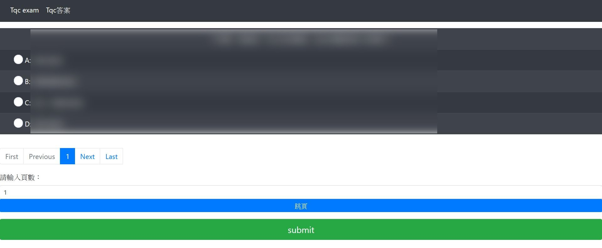
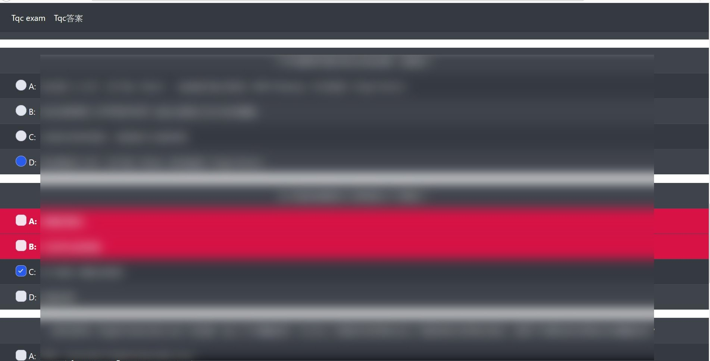

# TQC電子商務V4-網頁版
原先的TQC電子商務單機版有提供`mdb(Access)`的題庫，但只能用Excel看可讀性低。

於是練習使用Angular撰寫此網頁。

# Feature
- 直接觀看全部題目的答案 `紅色為正確答案`
- 可選擇練習題目
- 練習完畢可以只顯示錯誤答案

# DEMO Photo
 - 題庫

 - 選擇練習題目

 - 答題畫面

 - 練習完畢

# 注意
- 此為學術用途
- 題庫請自行放入`src/assests`
- 題庫請自行將`access mdb`檔案轉成`xls` 且檔名為 `EXAM.mdb.xls`